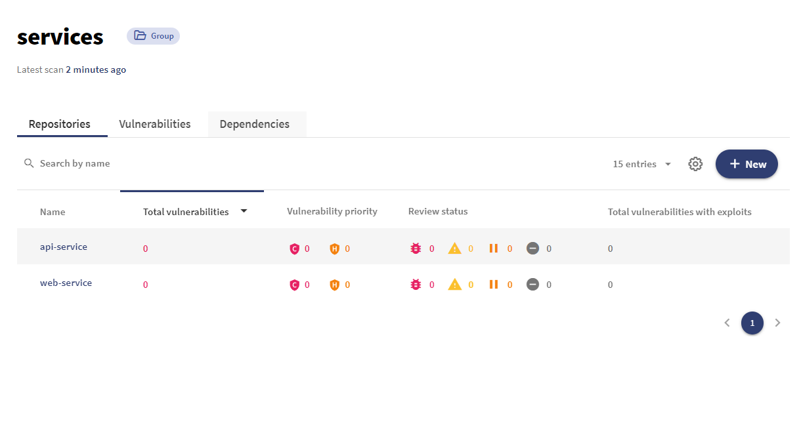

# Debricked scans with different services in same repo

It is a common pattern to have different services in the same repo. You probably want to view them separatly in debricked as well, is a guide on how to make this possible in the form of a github action.

Please view: .github/workflows/debricked.yml

## How it looks in debricked: 

